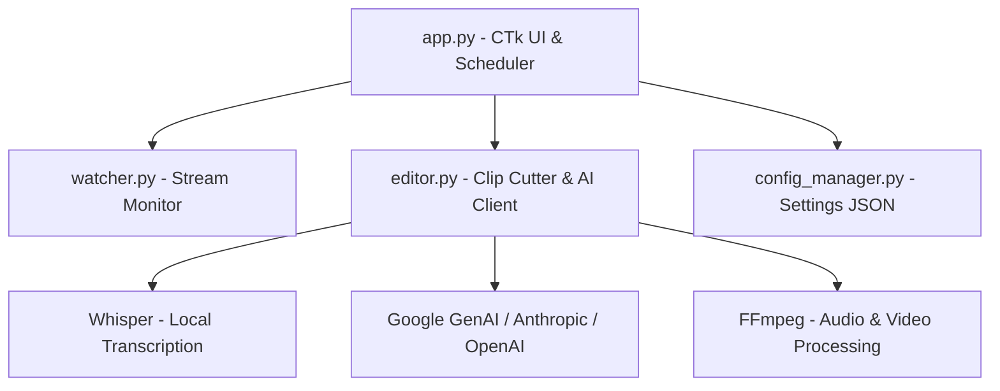

# Contributing to jBahr's Clip Generator

Welcome! This document provides instructions for setting up the development environment, understanding the application's architecture, running tests, and compiling/packaging the application.

---

## 🛠️ Local Environment Setup

The application is written in **Python 3.12+** and uses **CustomTkinter** for its graphical user interface.

### 1. Prerequisites
Ensure you have the following installed on your machine:
* **Python 3.12 or newer**
* **Git**
* **NVIDIA CUDA Toolkit** (Optional, but highly recommended for GPU-accelerated local transcription via Whisper and torch).

### 2. Setting Up the Virtual Environment
Clone the repository and set up a Python virtual environment:

```powershell
# Clone the repository
git clone https://github.com/jBahrVR/jBahrs-Clip-Generator.git
cd jBahrs-Clip-Generator

# Create a virtual environment named '.venv'
python -m venv .venv

# Activate the virtual environment
# On Windows (PowerShell):
.\.venv\Scripts\Activate.ps1
# On Windows (CMD):
.\.venv\Scripts\activate.bat
# On Unix/macOS:
source .venv/bin/activate
```

### 3. Installing Dependencies
Install all required packages listed in the `requirements.txt` manifest:

```powershell
pip install --upgrade pip
pip install -r requirements.txt
```

> [!NOTE]
> If you plan to run local GPU-accelerated transcriptions, ensure that the PyTorch version installed matches your CUDA version. See the [PyTorch Get Started](https://pytorch.org/get-started/locally/) guide for custom pip installation strings if CUDA acceleration is not working out-of-the-box.

### 4. Binary Dependencies (FFmpeg & yt-dlp)
The application relies on external executables (`ffmpeg.exe` and `yt-dlp.exe`) to download streams, extract audio, and cut videos.
* **Startup Bootstrapper:** On startup, `app.py` checks if these binaries exist in the application folder. If they are missing, a progress dialog automatically runs to download them.
* **Manual Override:** You can manually place current Windows executables (`ffmpeg.exe` and `yt-dlp.exe`) in the project root directory.

---

## 🏗️ Codebase Architecture



### File Map
* **[app.py](file:///D:/Dev%20Projects/Clipgen/jBahrs-Clip-Generator/app.py)**: The main entry point. Houses the CustomTkinter GUI layout, tab definitions (Manual Clipper, Clip Gallery, Scheduler, Prompts, Settings), background watcher scheduler thread, and key validation endpoints. Also includes the binary bootstrap downloader logic.
* **[editor.py](file:///D:/Dev%20Projects/Clipgen/jBahrs-Clip-Generator/editor.py)**: The processing engine. Contains functions to extract audio via FFmpeg, invoke local Whisper models, calculate RMS loudness peaks, run combat spike detection heuristics, prompt the AI engine, parse clips, and run final FFmpeg render clips with vertical video cropping and stabilization.
* **[watcher.py](file:///D:/Dev%20Projects/Clipgen/jBahrs-Clip-Generator/watcher.py)**: A background monitor helper that checks YouTube/Twitch channels for new streams and triggers automated clipper pipelines.
* **[config_manager.py](file:///D:/Dev%20Projects/Clipgen/jBahrs-Clip-Generator/config_manager.py)**: Manages loading, saving, and defaulting application configurations in `%APPDATA%\jBahrsClipGenerator\config.json`.

---

## 🧪 Running Unit & Integration Tests

The repository includes a suite of unit tests for key application components.

### Running the Test Suite
Ensure your virtual environment is active and run the tests:

```powershell
python -m unittest discover -p "test_*.py"
```

### Test Files
* **[test_app.py](file:///D:/Dev%20Projects/Clipgen/jBahrs-Clip-Generator/test_app.py)**: Tests GUI configuration validation logic, including parsing YouTube video IDs from URLs.
* **[test_config_manager.py](file:///D:/Dev%20Projects/Clipgen/jBahrs-Clip-Generator/test_config_manager.py)**: Verifies file configuration loading, saving, defaults, and directory paths.
* **[test_editor.py](file:///D:/Dev%20Projects/Clipgen/jBahrs-Clip-Generator/test_editor.py)**: Tests video-to-audio extraction parameters, Whisper arguments translation, and AI clip retrieval processing.
* **[test_watcher.py](file:///D:/Dev%20Projects/Clipgen/jBahrs-Clip-Generator/test_watcher.py)**: Exercises Lookback check windows and scheduler intervals.

---

## 📦 Compilation & Packaging (PyInstaller)

To bundle the application into a standalone Windows executable (`.exe`):

### 1. Install PyInstaller
Ensure PyInstaller is installed in your virtual environment:
```powershell
pip install pyinstaller
```

### 2. Packaging CustomTkinter Assets
CustomTkinter relies on assets (themes, icons) that PyInstaller does not automatically detect. You must explicitly include them.
Locate the `customtkinter` directory in your virtual environment:
* On Windows: `.venv\Lib\site-packages\customtkinter`

### 3. Build Command
Run PyInstaller with the required settings:

```powershell
pyinstaller --noconsole --onefile --icon=app_icon.ico --name="jBahrs-Clip-Generator" --add-data ".venv/Lib/site-packages/customtkinter;customtkinter/" app.py
```

* `--noconsole`: Hides the default command-prompt window behind the GUI.
* `--onefile`: Combines all Python files and standard libraries into a single file.
* `--add-data`: Injects customtkinter files so UI styles render properly.

The generated executable will be placed in the `dist/` directory.

> [!TIP]
> Do not bundle `ffmpeg.exe` or `yt-dlp.exe` inside the installer. By keeping them separate and letting the application auto-download them on startup, you reduce the initial installer size by over 160 MB!
